# API 中转站搭建操作手册

> 原文来源：[@ResearchWang](https://x.com/ResearchWang/status/2033023897684291814)
> 整理时间：2026-03-16

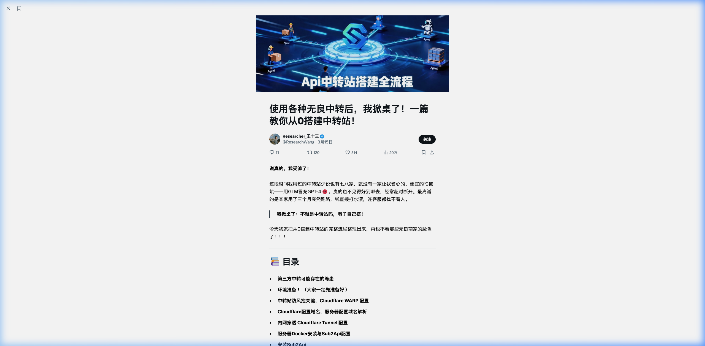

---

## 📚 目录

1. [第三方中转可能存在的隐患](#一第三方中转可能存在的隐患)
2. [环境准备](#二搭建中转站的环境准备)
3. [Cloudflare WARP 配置（防风控）](#三中转站防风控关键cloudflare-warp-配置)
4. [Cloudflare 配置域名与解析](#四cloudflare-配置域名与解析)
5. [Cloudflare Tunnel 内网穿透](#五内网穿透cloudflare-tunnel-配置)
6. [Docker 安装与配置](#六服务器-docker-安装与配置)
7. [安装 Sub2Api](#七安装-sub2api)
8. [账号池搭建](#八完成账号池搭建)
9. [后续接入](#九后续接入)

---

## 一、第三方中转可能存在的隐患

> [!CAUTION]
> 在使用第三方中转前务必了解以下五大风险。

| 风险 | 说明 |
|------|------|
| **模型造假** | 2026 年 CISPA 论文《Real Money, Fake Models》揭露近 45% 的中转站存在造假，性能差异约 47.21% |
| **流量虚扣** | 伪造日志，多计 10%–30% 的 Token 用量 |
| **卷款跑路** | 高额充值拉新后直接关站 |
| **数据安全** | 隐私和商业机密对中转方完全透明 |
| **服务不稳定** | 高并发易被风控，任务成功率低 |

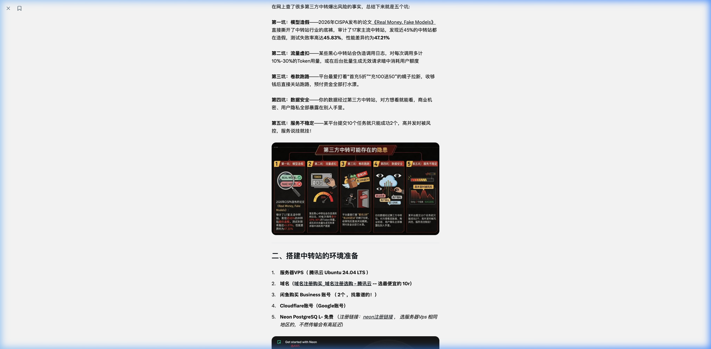

---

## 二、搭建中转站的环境准备

需要准备以下 6 项资源：

| # | 资源 | 说明 |
|---|------|------|
| 1 | **服务器 VPS** | 推荐腾讯云 Ubuntu 24.04 LTS |
| 2 | **域名** | 在腾讯云等平台注册（建议 10 元左右的便宜域名） |
| 3 | **账号池** | 准备 GPT Business 账号（建议闲鱼购买） |
| 4 | **Cloudflare 账号** | 用 Google 账号直接注册 |
| 5 | **Neon PostgreSQL（免费）** | 分布式数据库，选与 VPS 相同地区（如新加坡） |
| 6 | **Upstash Redis（免费）** | 缓存服务，选与 VPS 相同地区 |

### 2.1 创建 Neon 数据库

1. 注册 Neon 账号
2. 创建 Project，名称如 `neondb`
3. 地区选择 **AWS 新加坡（ap-southeast-1）**
4. 记录下生成的**连接字符串**

### 2.2 创建 Upstash Redis

1. 注册 Upstash 账号
2. 点击 **Create Database**
3. Name 设为如 `OpenClaw`，Type 选 `Global`
4. 选与 VPS 相同地区
5. 记录下生成的**连接地址和密码**

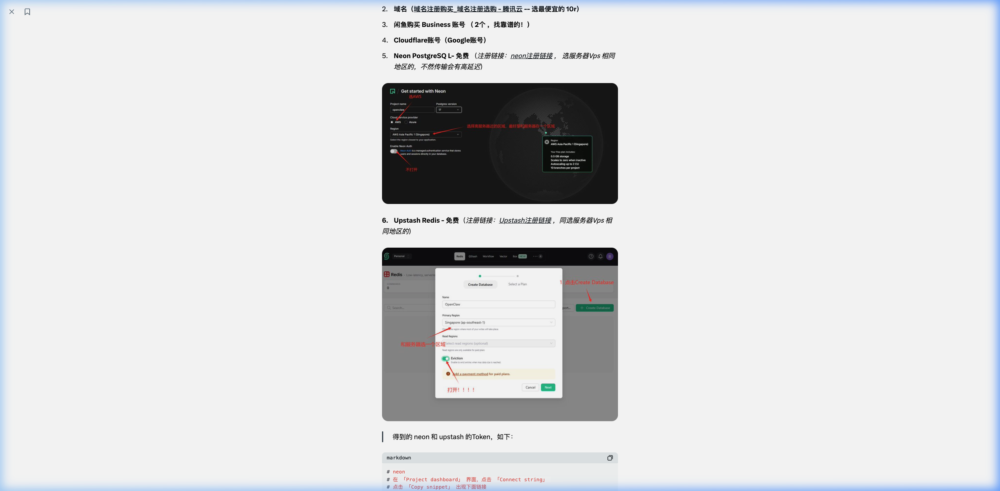

### 2.3 关键 Token 示例

```bash
# Neon 数据库连接字符串（示例）
postgresql://neondb_owner:<password>@ep-xxxxx.ap-southeast-1.aws.neon.tech/neondb?sslmode=require&channel_binding=require

# Upstash Redis 连接地址（示例）
redis-cli --tls -u redis://default:<password>@<host>.upstash.io:6379
```

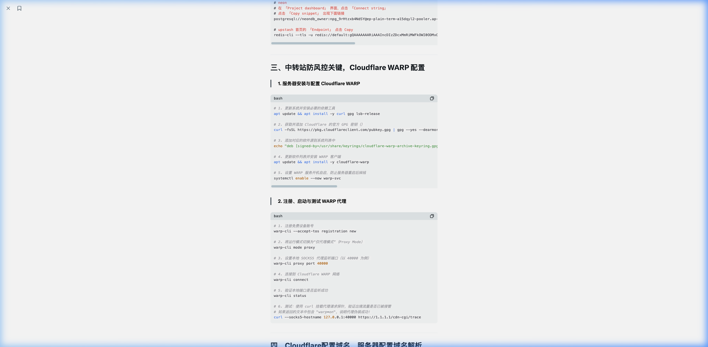

---

## 三、中转站防风控关键：Cloudflare WARP 配置

> [!IMPORTANT]
> WARP 代理可以有效防止因 IP 被风控导致的服务中断。

### 步骤 1：安装依赖工具与 GPG 密钥

```bash
apt update && apt install -y curl gpg lsb-release

curl -fsSL https://pkg.cloudflareclient.com/pubkey.gpg \
  | gpg --yes --dearmor --output /usr/share/keyrings/cloudflare-warp-archive-keyring.gpg

echo "deb [signed-by=/usr/share/keyrings/cloudflare-warp-archive-keyring.gpg] \
  https://pkg.cloudflareclient.com $(lsb_release -cs) main" \
  | tee /etc/apt/sources.list.d/cloudflare-client.list

apt update && apt install -y cloudflare-warp
systemctl enable --now warp-svc
```

### 步骤 2：启动并测试代理

```bash
# 注册新设备
warp-cli --accept-tos registration new

# 设置为代理模式
warp-cli mode proxy

# 指定代理端口
warp-cli proxy port 40000

# 连接
warp-cli connect

# 验证代理是否生效（返回内容需包含 warp=on）
curl --socks5-hostname 127.0.0.1:40000 https://1.1.1.1/cdn-cgi/trace
```

> [!TIP]
> 验证命令返回中看到 `warp=on` 即表示 WARP 代理配置成功。

---

## 四、Cloudflare 配置域名与解析

> 目的：将域名托管给 CF，隐藏真实 IP 并自动配置 HTTPS。

### 操作步骤

1. 登录 Cloudflare，搜索 **"Onboard a domain"**，添加你的域名（不带 www）
2. 选择 **Free Plan**
3. 获取 CF 提供的 NS 地址（如 `xxxxx.ns.cloudflare.com`）
4. 前往域名注册商后台，将 **DNS 服务器**修改为 CF 提供的 NS 地址
5. 等待生效后，CF 面板展示 **"Success"** 状态

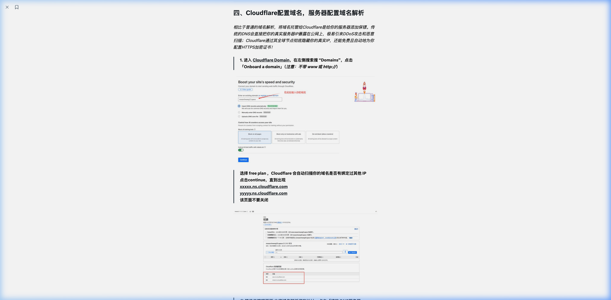

---

## 五、内网穿透：Cloudflare Tunnel 配置

> [!IMPORTANT]
> Tunnel 模式下，服务器无需对外开放任何端口，安全性极高。

### 操作步骤

1. 进入 CF **Zero Trust** 面板，点击 **"Add a Tunnel"**
2. 为 Tunnel 取名，保存后生成 **Token**
3. 配置 **Public Hostname**：

| 字段 | 值 |
|------|------|
| Subdomain | 留空 |
| Domain | 选择你的域名 |
| Path | 留空 |
| Type | `HTTP` |
| URL | `localhost:8080` |

4. 保存 Tunnel Token，后续写入 `docker-compose.yml`

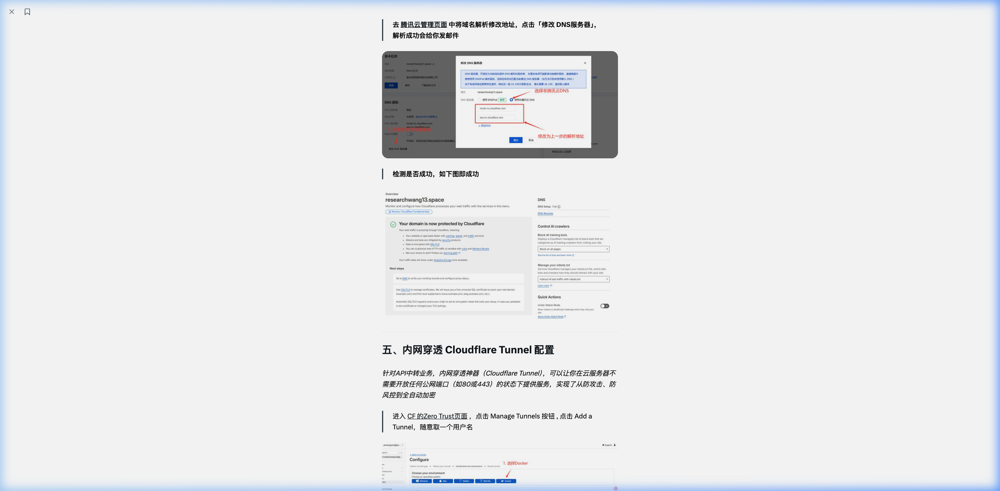

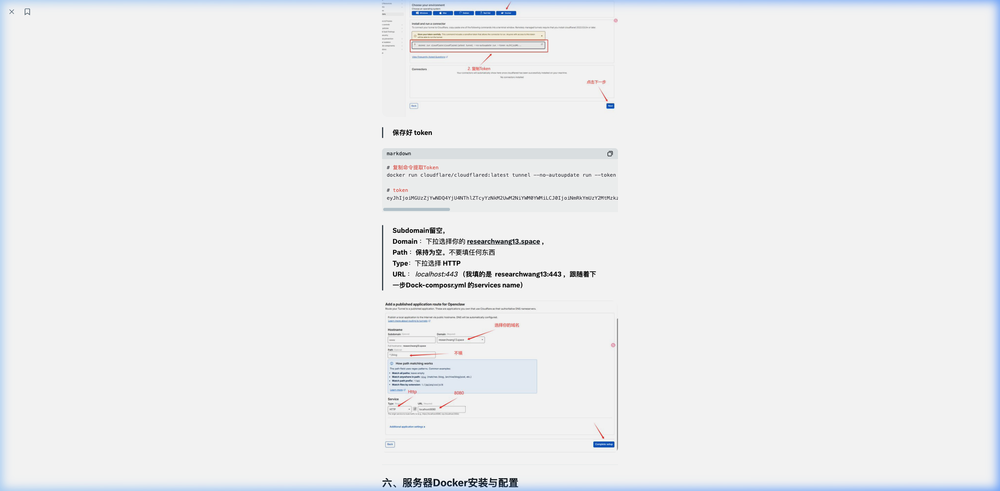

---

## 六、服务器 Docker 安装与配置

### 步骤 1：安装 Docker

```bash
curl -fsSL https://get.docker.com -o get-docker.sh
sh get-docker.sh
```

### 步骤 2：创建 `docker-compose.yml`

在服务器上创建工作目录并编写配置文件：

```yaml
version: '3.8'
services:
  sub2api:
    image: weishaw/sub2api:latest
    container_name: sub2api_core
    restart: always
    network_mode: "host"
    environment:
      - TZ=Asia/Shanghai
      - SERVER_PORT=8080
      - DATABASE_HOST=ep-xxxxx.ap-southeast-1.aws.neon.tech   # ← 替换为你的 Neon 主机
      - DATABASE_USER=neondb_owner                             # ← 替换为你的用户名
      - DATABASE_PASSWORD=your_neon_password                   # ← 替换为你的密码
      - DATABASE_DBNAME=neondb
      - DATABASE_SSL_MODE=require
      - REDIS_HOST=xxxxx.upstash.io                            # ← 替换为你的 Upstash 主机
      - REDIS_PORT=6379
      - REDIS_PASSWORD=your_upstash_password                   # ← 替换为你的密码
      - REDIS_USE_TLS=true

  cloudflared:
    image: cloudflare/cloudflared:latest
    container_name: cloudflared_tunnel
    restart: always
    network_mode: "host"
    command: tunnel run
    environment:
      - TUNNEL_TOKEN=your_tunnel_token_here                    # ← 替换为你的 Tunnel Token
```

> [!WARNING]
> 请务必将上述示例中所有 `your_xxx` 占位符替换为你的真实凭据。

### 步骤 3：启动服务

```bash
docker compose up -d
```

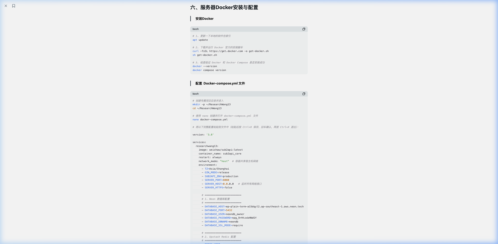

---

## 七、安装 Sub2Api

Docker 启动后，访问你的域名进入 **Web 安装向导**。

### 步骤 1：数据库配置

1. 输入 Neon 数据库的连接信息
2. 点击"测试连接"，确认提示 **"连接成功"**

### 步骤 2：缓存配置

1. 输入 Upstash Redis 地址与密码
2. **开启 "启用 TLS" 开关**
3. 点击"测试连接"，确认成功

### 步骤 3：创建管理员

1. 设置管理员用户名和密码
2. 完成安装向导

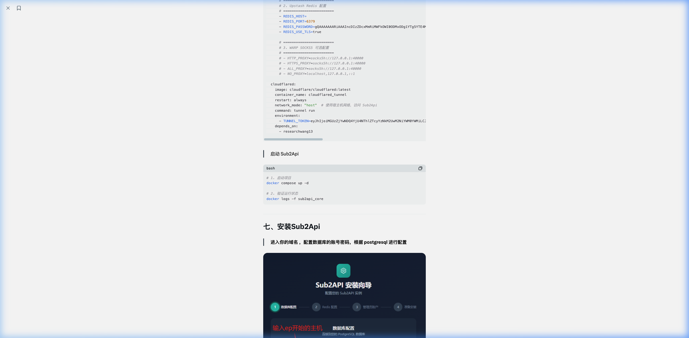

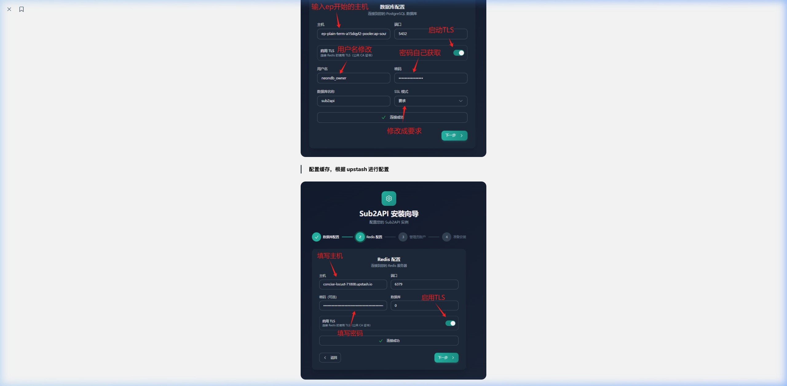

---

## 八、完成账号池搭建

### 步骤 1：创建分组

登录管理后台，进入分组管理，创建一个分组（如 `default`）。

### 步骤 2：添加账号

1. 选择平台（如 OpenAI）
2. 点击 **"授权方式"**
3. 登录 GPT 账号后，复制生成的 Token 或网页地址
4. 支持多种平台：Anthropic、OpenAI、Sora、Gemini、Antigravity 等

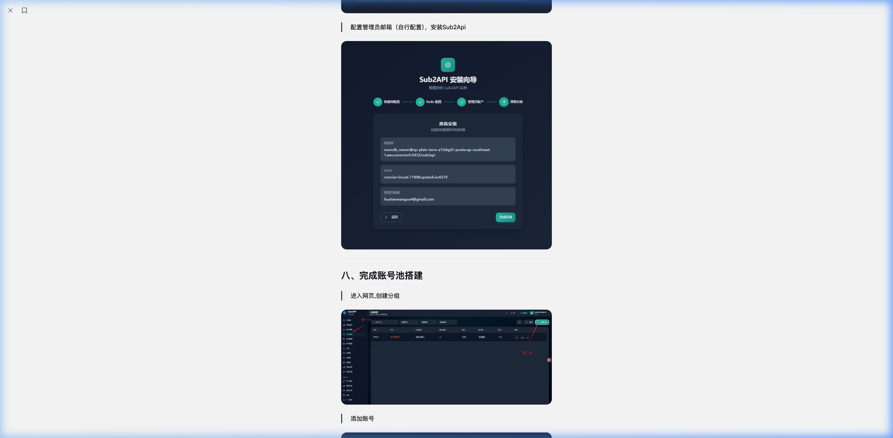

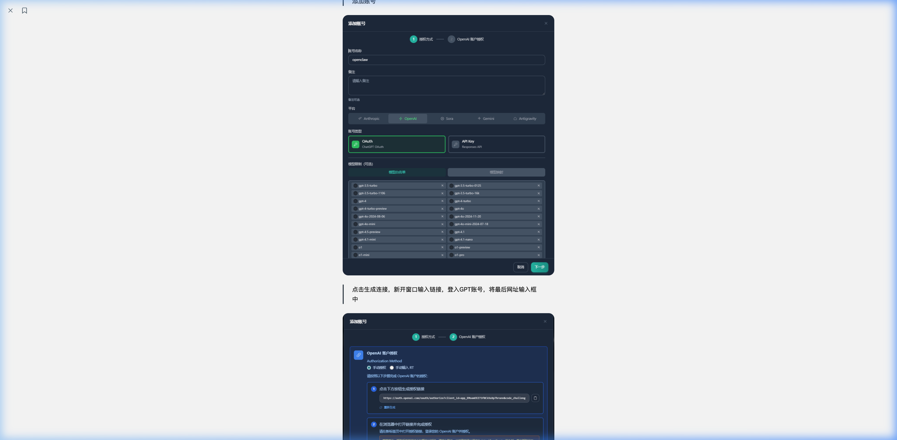

### 步骤 3：生成 API Key

1. 新开窗口输入链接，验证 GPT-4 等模型是否可用
2. 在 **用户管理** 界面给账号充值
3. 生成用于外部调用的 **API Key**


---

## 九、后续接入

搭建完成后，可以将生成的 API 接入以下工具中使用：

- **OpenClaw** — AI 网关
- **Codex** — 代码助手
- **ClaudeCode** — Claude 编程工具
- 其他兼容 OpenAI API 格式的工具

### 接入方式

```bash
# 设置环境变量（示例）
export OPENAI_API_BASE=https://your-domain.com/v1
export OPENAI_API_KEY=sk-your-generated-key
```

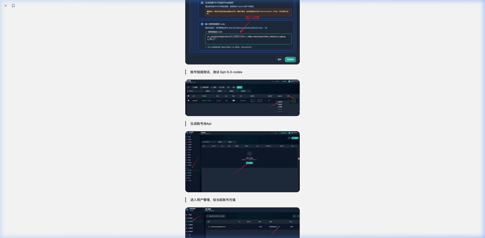

---

## 📋 快速检查清单

- [ ] VPS 已购买并能 SSH 连接
- [ ] 域名已注册
- [ ] Neon PostgreSQL 已创建，连接字符串已记录
- [ ] Upstash Redis 已创建，连接信息已记录
- [ ] Cloudflare WARP 已安装并验证 `warp=on`
- [ ] 域名已托管到 Cloudflare，NS 已切换
- [ ] Cloudflare Tunnel 已创建，Token 已记录
- [ ] Docker 已安装
- [ ] `docker-compose.yml` 已配置并启动
- [ ] Sub2Api 安装向导已完成
- [ ] 账号池分组已创建
- [ ] 至少一个 GPT 账号已添加
- [ ] API Key 已生成并测试可用

---

> **原文作者**：Researcher_王十三 (@ResearchWang)
> **原始链接**：https://x.com/ResearchWang/status/2033023897684291814
