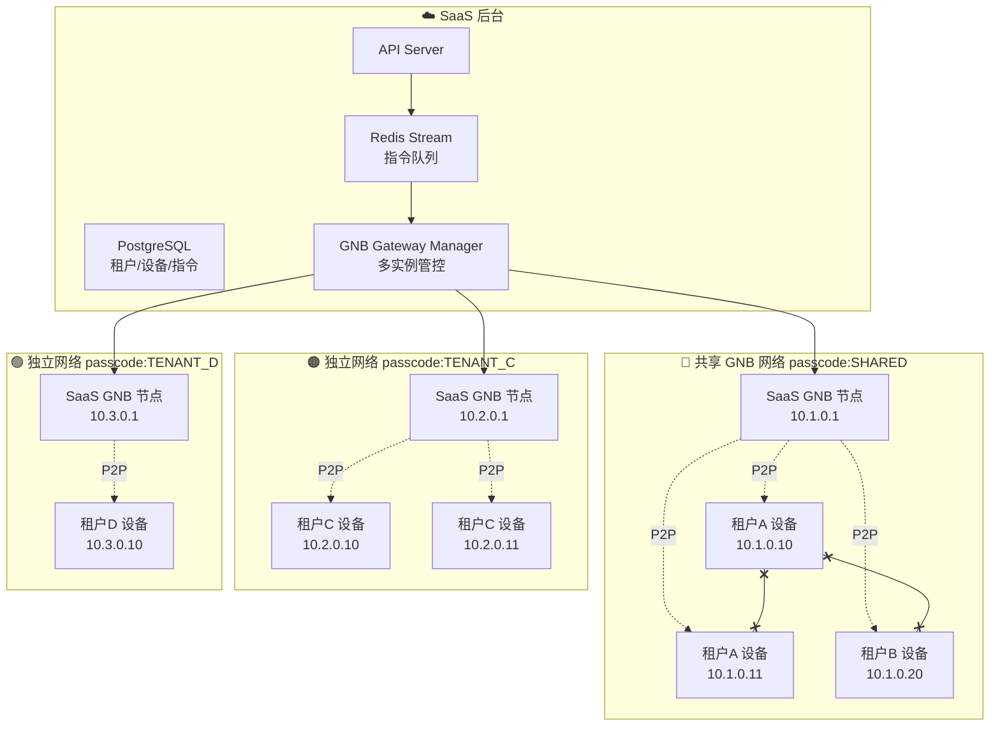
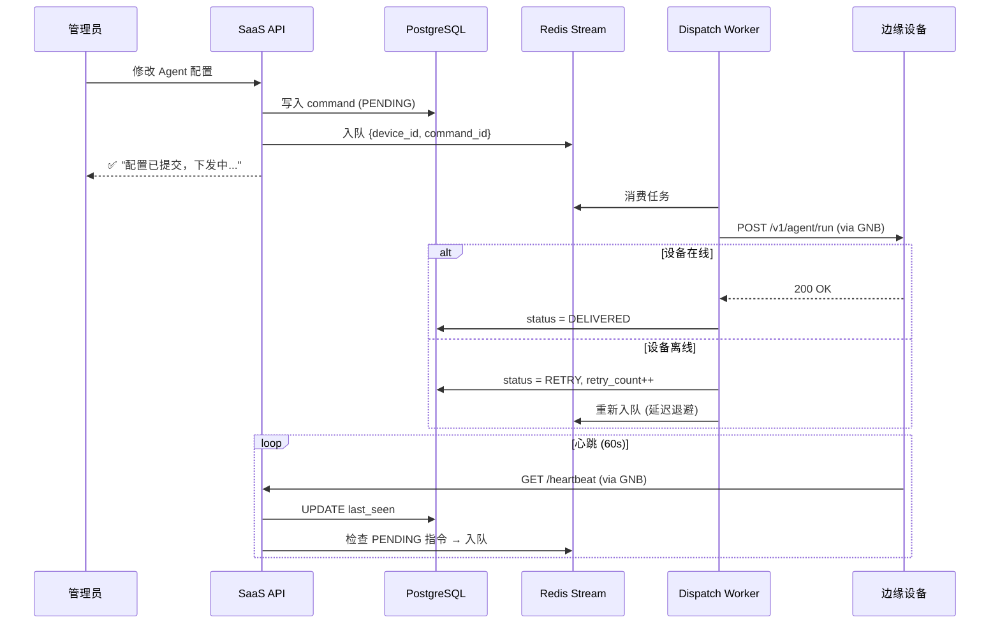
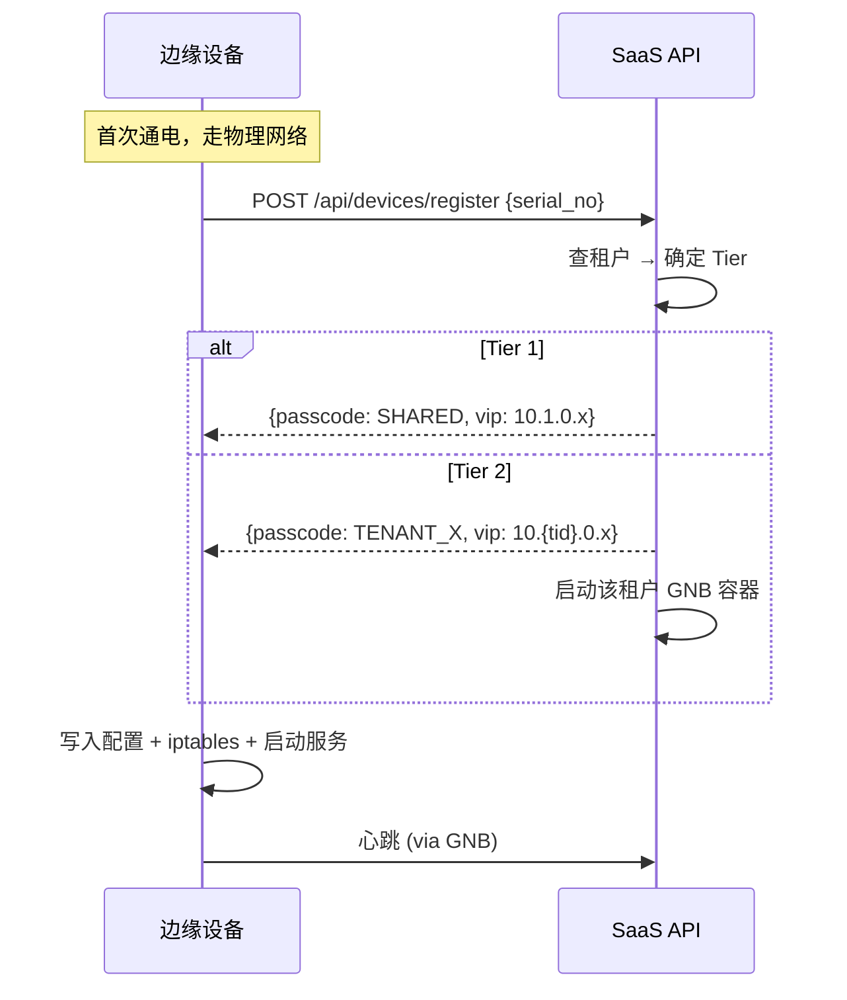

# OpenClaw + GNB 多租户分级网络架构方案

## 背景

OpenClaw Gateway 是一个 AI Agent 网关，当前部署在 Mac mini（`fnOS@192.168.10.5`），通过 WebSocket RPC / HTTP API / ACP 暴露控制接口。现需将其商业化为 SaaS + 边缘硬件的交付模式——每个租户拥有自己的边缘设备（运行 OpenClaw），SaaS 后台通过网络远程管理这些设备。

**核心需求**：采用 GNB 作为内网穿透方案，实现 SaaS 后台 ↔ 租户边缘设备的安全通信，同时：
- 小租户共享 GNB 网络（降低运维成本）
- 大租户独享 GNB 网络（彻底隔离）
- 所有租户的设备之间严格隔离（不可互通）

---

## 系统架构总览



---

## 租户分级策略

### 分级定义

| 等级 | 条件 | 网络方案 | SaaS 端实现 |
|------|------|----------|-------------|
| **Tier 1** | 设备数 ≤ 5 | 共享 GNB 网络 + iptables 隔离 | 单进程 GNB，共享 passcode |
| **Tier 2** | 设备数 > 5 或企业付费 | 独立 GNB 网络 | 独立 GNB 容器，独立 passcode + 网段 |

### Tier 1：共享网络 + 防火墙隔离

所有小租户设备和 SaaS 节点共用一个 GNB passcode，组成 `10.1.0.0/16` 虚拟网络。

**隔离机制**：每台边缘设备出厂镜像中预置 iptables 规则：

```bash
#!/bin/bash
# /etc/gnb/firewall.sh — 设备启动时执行
SAAS_VIP="10.1.0.1"       # SaaS 后台虚拟 IP
GNB_IF="gnb_tun"          # GNB 虚拟网卡

# 默认拒绝 GNB 网卡上所有流量
iptables -A INPUT   -i $GNB_IF -j DROP
iptables -A OUTPUT  -o $GNB_IF -j DROP
iptables -A FORWARD -i $GNB_IF -j DROP

# 仅允许与 SaaS 虚拟 IP 通信
iptables -I INPUT  1 -i $GNB_IF -s $SAAS_VIP -j ACCEPT
iptables -I OUTPUT 1 -o $GNB_IF -d $SAAS_VIP -j ACCEPT

# 允许 ICMP (链路检测)
iptables -I INPUT  2 -i $GNB_IF -s $SAAS_VIP -p icmp -j ACCEPT
iptables -I OUTPUT 2 -o $GNB_IF -d $SAAS_VIP -p icmp -j ACCEPT
```

> [!IMPORTANT]
> 设备 A 无法 ping 设备 B（即使同网段），只有 SaaS (`10.1.0.1`) 能与每台设备通信。

### Tier 2：独立网络彻底隔离

SaaS 后台为每个大租户动态生成：

| 参数 | 示例 |
|------|------|
| passcode | `A7F3B2E1`（随机 8 位 hex） |
| 网段 | `10.{tenant_id}.0.0/16` |
| SaaS 端节点 IP | `10.{tenant_id}.0.1` |
| 设备 IP 范围 | `10.{tenant_id}.0.10` ~ `.254` |

SaaS 端通过 Docker 运行独立 GNB 进程：

```bash
docker run -d --name gnb-tenant-c \
  --cap-add=NET_ADMIN --device=/dev/net/tun \
  -e GNB_NODE_ID=1001 \
  -e GNB_PASSCODE=A7F3B2E1 \
  -e GNB_INDEX="101.32.178.3/9001" \
  gnb-image:latest
```

---

## 三大技术难点解法

### 难点 1：OpenClaw Loopback 限制

**问题**：Gateway 默认 `bind: "loopback"` 只监听 `127.0.0.1`，GNB 的 `10.x.x.x` 流量无法到达。

**方案：socat 端口映射**（推荐，最小侵入）

```bash
# /etc/systemd/system/openclaw-gnb-bridge.service
[Service]
ExecStart=/usr/bin/socat \
  TCP-LISTEN:18789,bind=10.1.0.10,reuseaddr,fork \
  TCP:127.0.0.1:18789
Restart=always
```

> [!TIP]
> 选 socat 而非改 `bind: 0.0.0.0` 的理由：
> - 物理网卡（eth0/wlan0）上的 18789 不暴露
> - OpenClaw 升级不受影响
> - 安全边界清晰

**备选**：`config.patch` 改为 `bind: 0.0.0.0` + iptables 限制只允许 GNB 网卡流量。

### 难点 2：多租户隔离

已在上方"租户分级策略"覆盖：
- **Tier 1**：iptables 白名单仅允许 SaaS VIP
- **Tier 2**：独立 passcode + 独立网段 + 独立 GNB 进程

### 难点 3：网络波动与最终一致性

**架构：异步指令队列 + 心跳补发**



| 决策点 | 选择 | 理由 |
|--------|------|------|
| 队列 | Redis Stream | 轻量，支持消费者组 + ACK |
| 重试 | 指数退避 30s→60s→120s→300s | 避免浪费带宽 |
| 最大重试 | 48 次（~24h） | 超时标记 FAILED + 告警 |
| 心跳方向 | 设备→SaaS | 设备在 NAT 后，主动探测不可靠 |
| 补发 | 心跳触发 + 定时扫描双保险 | 5 分钟全量扫描兜底 |

---

## 设备出厂镜像预置

```
/opt/openclaw/
├── bin/
│   ├── openclaw          # Gateway 二进制
│   ├── gnb               # GNB 二进制
│   ├── gnb_crypto        # 密钥工具
│   └── socat             # 端口桥接
├── config/
│   ├── openclaw.yaml     # bind: loopback
│   ├── gnb/node.conf     # 出厂模板
│   └── firewall.sh       # iptables 隔离规则
├── scripts/
│   ├── provision.sh      # 首次注册 → 获取 node_id/passcode/VIP
│   └── heartbeat.sh      # 心跳上报 (cron)
└── systemd/
    ├── gnb.service
    ├── openclaw.service
    └── openclaw-gnb-bridge.service
```

### 设备注册流程



---

## SaaS 后台组件

| 组件 | 职责 | 选型 |
|------|------|------|
| API Server | 租户/设备管理，配置下发入口 | Node.js / Go |
| GNB Gateway Manager | 管理多 GNB 实例（Tier 2） | Docker API |
| Dispatch Worker | 消费指令队列，推送到设备 | Node.js Worker |
| PostgreSQL | 租户、设备、指令存储 | PG 15+ |
| Redis | 指令队列、在线缓存 | Redis 7+ |

## GNB 节点 ID 分配

| 范围 | 用途 |
|------|------|
| `1001`~`1099` | SaaS GNB 节点 |
| `1100`~`1199` | 监控/运维跳板 |
| `2001`~`9999` | 租户设备 |

## 安全加固

1. **禁用 Lite 模式**：生产环境必须用非对称加密（`gnb_crypto` 预生成密钥对）
2. **Passcode 随机**：`openssl rand -hex 4` 生成
3. **自建 Index 节点**：2~3 个，部署在不同地域云服务器
4. **Token 轮换**：OpenClaw Token 定期轮换，通过指令队列下发
5. **TLS 叠加**：socat 可升级为 `openssl-listen`（纵深防御）

---

## Verification Plan

本方案为架构设计文档，验证方式为 PoC 手动测试：

1. 2 台设备部署 GNB → 验证 P2P 穿透互 ping
2. 设备 A 配置 iptables → 验证设备 A 无法 ping 设备 B，但能 ping SaaS 节点
3. socat 桥接 → 验证通过 GNB VIP 可访问 OpenClaw API
4. 模拟断线重连 → 验证指令队列补发机制
