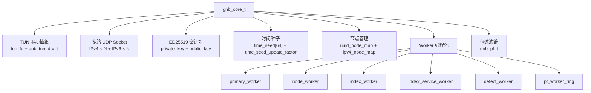

# OpenGNB 源码审计报告

> 审计对象：[gnbdev/opengnb](https://github.com/gnbdev/opengnb) 源码
> 审计时间：2026-03-16（初版）· 2026-03-16（密钥轮换机制深审修订）
> 关联文档：[gnb_deployment_guide.md](file:///Users/liyuqing/sproot/synonclaw/docs/gnb_deployment_guide.md)

---

## 一、项目概况

| 指标 | 值 |
|------|-----|
| **仓库** | [gnbdev/opengnb](https://github.com/gnbdev/opengnb) |
| **License** | GPL-3.0 |
| **语言** | C 99.6% · Makefile 0.4% |
| **Commits** | 191 |
| **Releases** | 4 |
| **Stars** | 1.2k |
| **平台** | Linux, macOS, FreeBSD, OpenBSD, Windows (MinGW), OpenWRT, Raspberry Pi |
| **Linux 发行版** | Debian 12 `apt install opengnb` · Arch AUR |
| **外部依赖** | **零** — 所有第三方库源码内置编译 |

---

## 二、架构分析

### 核心结构 `gnb_core_t`



### 源码模块划分

| 模块 | 文件 | 职责 |
|------|------|------|
| **核心** | `gnb_core.c`, `gnb.h` | 主循环、核心数据结构 |
| **密钥管理** | `gnb_keys.c`, `gnb_keys.h` | ED25519 密钥加载、**时间种子更新**、通信密钥派生 |
| **加密** | `src/crypto/arc4/`, `src/crypto/xor/`, `src/crypto/random/` | 数据包流加密 |
| **签名认证** | `gnb_keys.c` + `libs/ed25519/` | ED25519 节点身份认证 + **shared_secret 生成** |
| **NAT 穿透** | `gnb_detect_worker.c`, `gnb_index_worker.c` | 地址发现 + NAT 探测 |
| **包过滤** | `gnb_pf.c`, `gnb_pf_worker.c`, `src/packet_filter/` | 数据包处理管线（含加解密） |
| **TUN 驱动** | `gnb_tun_drv.h` + 平台目录 | 虚拟网卡抽象（TUN） |
| **统一转发** | `gnb_unified_forwarding.c` | 多路径数据中继 |
| **信令** | `gnb_index_service_worker.c`, `gnb_secure_index_*` | Index 节点服务 |
| **基础设施** | `gnb_alloc.c`, `gnb_hash32.c`, `gnb_lru32.c`, `gnb_ring_buffer_fixed.c`, `gnb_doubly_linked_list.c`, `gnb_fixed_pool.c` | 自研数据结构 |
| **平台适配** | `src/Darwin/`, `src/linux/`, `src/freebsd/`, `src/mingw/`, `src/openbsd/` | OS 特定实现 |

### 内置第三方库

| 库 | 用途 | 来源 |
|----|------|------|
| **ed25519** | 椭圆曲线数字签名 + **SHA-512 哈希** | [orlp/ed25519](https://github.com/orlp/ed25519) |
| **miniupnpc** | UPnP 自动端口映射 | [miniupnp](https://github.com/miniupnp/miniupnp) |
| **libnatpmp** | NAT-PMP 端口映射 | miniupnp 项目 |
| **zlib** | 数据压缩 | [zlib.net](https://www.zlib.net/) |
| **wintun/tap-windows6** | Windows TUN/TAP 驱动 | WireGuard / OpenVPN |
| **hash** | 哈希函数 | — |
| **protocol** | 协议定义 | — |

---

## 三、🔑 时间同步密钥轮换机制（深度分析）

> [!IMPORTANT]
> 本章节基于 `gnb_keys.c`、`gnb_pf_crypto_arc4.c`、`gnb_node_type.h`、`gnb_conf_type.h`、`gnb_argv.c` 源码的逐行审计。

### 3.1 机制概述

GNB 实现了一套**基于 UTC 时钟的确定性密钥轮换系统**。所有对等节点无需显式协商，仅依赖各自的系统时钟即可在同一时刻独立派生出相同的通信密钥。

```
┌─────────────────────────────────────────────────────────────────┐
│                   密钥派生管线 (Key Derivation Pipeline)          │
├─────────────────────────────────────────────────────────────────┤
│                                                                 │
│  UTC 时钟 ──→ time_seed (32-byte SHA-512 摘要)                  │
│                    │                                            │
│                    ├── NONE 模式: 不参与, 用 shared_secret 替代  │
│                    ├── HOUR 模式: year+mon+yday+hour             │
│                    └── MINUTE 模式: year+mon+yday+hour+min       │
│                                                                 │
│  ┌────────────────────────────────────────────────────┐         │
│  │ gnb_build_crypto_key()                             │         │
│  │                                                    │         │
│  │  buffer[68] = time_seed[32]                        │         │
│  │             ∥ shared_secret[32]                    │         │
│  │             ∥ passcode[4]                          │         │
│  │                                                    │         │
│  │  crypto_key[64] = SHA-512(buffer)                  │         │
│  └────────────────────────────────────────────────────┘         │
│                    │                                            │
│                    ▼                                            │
│         ARC4 / XOR S-Box 初始化 → 对称流加密                     │
│                                                                 │
└─────────────────────────────────────────────────────────────────┘
```

### 3.2 源码关键函数

#### `gnb_update_time_seed()` — 时间种子生成

```c
// gnb_keys.c — 核心：从 UTC 时间分量生成 time_seed
void gnb_update_time_seed(gnb_core_t *gnb_core, uint64_t now_sec) {
    time_t t = (time_t)now_sec;
    struct tm ltm;
    gmtime_r(&t, &ltm);  // 使用 UTC 时间

    uint32_t time_seed = ltm.tm_year + ltm.tm_mon + ltm.tm_yday;

    if (HOUR 模式)   time_seed += ltm.tm_hour;
    if (MINUTE 模式)  time_seed += ltm.tm_hour + ltm.tm_min;

    time_seed = htonl(time_seed);  // 网络字节序，跨平台一致
    sha512(&time_seed, 4, gnb_core->time_seed);  // 输出 64 字节
}
```

> **审计发现**：`time_seed` 是一个 **32-bit 整数**（年+月+年日+小时+分钟的代数和），经 SHA-512 扩展为 64 字节。所有节点只要系统时钟足够同步（误差 < 1 分钟），就能独立计算出相同的 `time_seed`。

#### `gnb_build_crypto_key()` — 通信密钥派生

```c
// gnb_keys.c — 最终通信密钥的派生
void gnb_build_crypto_key(gnb_core_t *gnb_core, gnb_node_t *node) {
    unsigned char buffer[68];

    // 模式分支：NONE 模式用 shared_secret 填充前 32 字节,
    //           否则用 time_seed
    if (interval != NONE)
        memcpy(buffer, gnb_core->time_seed, 32);
    else
        memcpy(buffer, node->shared_secret, 32);

    memcpy(buffer+32, node->shared_secret, 32);  // 后 32 字节始终是 shared_secret
    memcpy(buffer+64, gnb_core->conf->crypto_passcode, 4);  // 最后 4 字节是 passcode

    // 保留旧密钥用于过渡期解密
    memcpy(node->pre_crypto_key, node->crypto_key, 64);

    // 最终密钥 = SHA-512(time_seed ∥ shared_secret ∥ passcode)
    sha512(buffer, 68, node->crypto_key);
}
```

#### `gnb_verify_seed_time()` — 密钥变更检测

```c
// gnb_keys.c — 返回非零值表示需要换钥
int gnb_verify_seed_time(gnb_core_t *gnb_core, uint64_t now_sec) {
    // HOUR 模式: 检测 tm_hour 是否变化
    // MINUTE 模式: 检测 tm_min 是否变化
    int r = (当前时间因子) - gnb_core->time_seed_update_factor;
    gnb_core->time_seed_update_factor = 当前时间因子;
    return r;  // 0 = 无变化, 非零 = 需换钥
}
```

#### ARC4 包过滤中的懒更新

```c
// gnb_pf_crypto_arc4.c — 每个加解密回调中检查
static int pf_tun_route_cb(...) {
    if (ctx->save_time_seed_update_factor != gnb_core->time_seed_update_factor) {
        init_arc4_keys(gnb_core, pf);  // 重新为所有节点派生密钥 + 初始化 S-Box
    }
    // ... 正常加密流程
}
```

### 3.3 数据结构（`gnb_node_t` 密钥相关字段）

```c
// gnb_node_type.h
typedef struct _gnb_node_t {
    unsigned char public_key[32];       // ED25519 公钥
    unsigned char shared_secret[32];    // ED25519 密钥交换或 passcode 派生的共享密钥
    unsigned char crypto_key[64];       // 当前通信密钥 (SHA-512 输出)
    unsigned char pre_crypto_key[64];   // 上一个通信密钥 (用于换钥过渡)
    unsigned char key512[64];           // 备用密钥槽
    // ...
} gnb_node_t;
```

### 3.4 配置与使用

| 参数 | CLI 选项 | 配置文件 | 默认值 |
|------|----------|----------|--------|
| 密钥更新间隔 | `--crypto-key-update-interval` | `node.conf` | `none`（不轮换） |
| 加密类型 | `--crypto-type` | `node.conf` | `xor` |
| Passcode | `--passcode` / `-p` | `node.conf` | `0xFFFCFFFE` |

```bash
# 启用每分钟密钥轮换 + ARC4 加密
gnb -n /etc/gnb/node_1001 \
    --crypto-type arc4 \
    --crypto-key-update-interval minute \
    --passcode 0xA7B3C9D1
```

### 3.5 机制评估

| 维度 | 评估 | 说明 |
|------|:----:|------|
| **密钥轮换频率** | ⭐⭐⭐⭐☆ | 最短 1 分钟，足够限制单个密钥窗口的数据暴露量 |
| **零协商开销** | ⭐⭐⭐⭐⭐ | 纯本地计算，无握手、无网络往返、无密钥协商协议 |
| **跨平台一致性** | ⭐⭐⭐⭐☆ | 依赖 `gmtime_r`（UTC）+ `htonl`（字节序），设计考虑了跨平台 |
| **过渡期处理** | ⭐⭐⭐⭐☆ | `pre_crypto_key` 保留旧密钥，在切换瞬间仍可解密对端旧密钥包 |
| **前向保密 (PFS)** | ⭐⭐☆☆☆ | **不是真正的 PFS**。time_seed 是确定性的（从时钟和 shared_secret 推导），如果 shared_secret 泄露 + 时钟已知，所有历史密钥可重建 |
| **加密原语强度** | ⭐⭐☆☆☆ | 底层仍是 ARC4/XOR，密钥再好也受限于流加密算法本身的弱点 |

#### 🟢 优势

1. **无协商 = 无协议漏洞**：不存在 TLS 式的握手降级攻击、中间人密钥协商劫持等风险
2. **极低资源开销**：整个换钥过程仅 1 次 SHA-512 + 1 次 ARC4 S-Box 初始化，32M 路由器也能承受
3. **时间窗口限制泄露范围**：即使某一时刻的密钥被破解，攻击者最多解密该窗口（1分钟/1小时）内的数据
4. **优雅过渡**：`pre_crypto_key` 机制避免了时钟微小偏差导致的通信中断

#### 🔴 局限

1. **确定性推导 ≠ 前向保密**：`shared_secret` 是长期不变的（基于 ED25519 密钥对或 Passcode），一旦泄露，配合已知时间可重建全部历史密钥
2. **时钟依赖**：节点间时钟偏差超过 1 分钟（MINUTE 模式）即导致密钥不同步，通信中断
3. **time_seed 熵值极低**：32-bit 整数（年+月+日+时+分的代数和），实际独立组合数远小于 2³²，可暴力穷举
4. **默认关闭**：出厂配置 `crypto_key_update_interval = NONE`，用户必须显式启用

---

## 四、安全审计（修订版）

### 🔴 Critical — 加密层较弱

| # | 风险 | 分析 |
|---|------|------|
| C1 | **ARC4 + XOR 流加密** | `src/crypto/` 目录只有 `arc4/`（RC4 变体）和 `xor/` 两种加密实现。RC4 **早在 2015 年就被 IETF 废弃**（[RFC 7465](https://datatracker.ietf.org/doc/html/rfc7465)），存在已知的统计分析偏差；XOR 加密更是仅提供混淆级别的"加密"。**没有 AES-GCM、ChaCha20-Poly1305 等现代 AEAD 密码套件。** |
| C2 | **无真正前向保密 (PFS)** | ~~（初版评估）认为完全没有密钥更新~~ → **修订**：GNB 确实有基于时间的密钥轮换，但这是**确定性推导**（`SHA-512(time_seed ∥ shared_secret ∥ passcode)`），不是 ECDHE 临时密钥交换。`shared_secret` 长期不变，一旦泄露，所有历史窗口的密钥可被重建。**降级为"有限前向保密"**。 |
| C3 | **Passcode 共享密钥** | Lite 模式下节点通过 8 字符 hex Passcode 组网。这是一个 32-bit 的共享密钥空间 — **可暴力枚举**（约 42 亿组合）。但若配合 Full 模式（ED25519 密钥对），shared_secret 由 ECDH 派生，强度大幅提升。 |

### 🟡 Warning — 中等风险

| # | 风险 | 分析 |
|---|------|------|
| W1 | **无代码审计历史** | 191 commits，4 releases，没有发现第三方安全审计记录 |
| W2 | **C 语言内存安全** | 纯 C 项目，自研内存分配器/数据结构，无 sanitizer/fuzzing 集成。缓冲区溢出、UAF 风险需人工审查 |
| W3 | **单人维护** | 主要由 gnbdev 一人维护，社区贡献者极少，总线风险高 |
| W4 | **ed25519 库版本老旧** | 使用 [orlp/ed25519](https://github.com/orlp/ed25519)，该库最后更新在 2017 年，非经审计的密码学实现 |
| W5 | **时钟偏差敏感** | MINUTE 模式下节点时钟偏差 >1 分钟将导致密钥不同步、通信中断。需 NTP 同步保障 |

### ✅ 安全优势

| # | 优势 | 分析 |
|---|------|------|
| S1 | **ED25519 节点认证** | 非对称签名验证节点身份，防止节点冒充 |
| S2 | **时间同步密钥轮换** | 最短 1 分钟变更通信密钥，限制了单个密钥窗口的数据暴露范围，且零协商开销 |
| S3 | **per-node 密钥隔离** | 每个节点对维护独立的 `shared_secret` → 独立的 `crypto_key`，一个节点失陷不影响其他链路 |
| S4 | **Index 节点不接触数据** | 纯信令（类 BT Tracker），不中转业务数据包 |
| S5 | **零外部依赖** | 不依赖动态库，消除了 DLL hijack / .so preload 攻击面 |
| S6 | **Secure Index 模式** | `--address-secure=on` 提供地址验证 |
| S7 | **Forward 节点也无法窃听** | 数据经 Forward 中继时使用 per-node 密钥加密，中间节点无法解密 |
| S8 | **优雅换钥过渡** | `pre_crypto_key` 保留上一周期密钥，避免切换瞬间的包丢失 |

---

## 五、代码质量评估

### 评分矩阵（修订版）

| 维度 | 评分 | 说明 |
|------|:----:|------|
| **架构清晰度** | ⭐⭐⭐⭐☆ | Worker 线程模型清晰，平台抽象层干净 |
| **可移植性** | ⭐⭐⭐⭐⭐ | 7+ 平台，零依赖，32M 路由器可运行 |
| **内存效率** | ⭐⭐⭐⭐⭐ | 固定内存池 + 环形缓冲区，零运行时 malloc |
| **密钥管理** | ⭐⭐⭐☆☆ | 时间同步轮换设计精巧，但缺乏真正 PFS 和现代 KDF |
| **加密原语** | ⭐⭐☆☆☆ | ARC4/XOR 不满足现代密码学标准 |
| **测试覆盖** | ⭐☆☆☆☆ | 未发现单元测试框架或测试用例 |
| **文档** | ⭐⭐⭐☆☆ | 有中英文 README，缺乏代码级文档和协议规范 |
| **社区活跃度** | ⭐⭐☆☆☆ | 191 commits，4 releases，主要单人维护 |

### 代码风格观察

```c
// 优点：严格的平台抽象 + 明确的头文件守卫
// gnb.h 通过 gnb_platform.h 统一平台差异，各平台实现隔离到独立目录

// 亮点：gnb_pf_crypto_arc4.c 中的懒更新设计
// 每个包过滤回调检查 save_time_seed_update_factor != gnb_core->time_seed_update_factor
// 仅在时间窗口跨越时才批量重建密钥，兼顾性能与安全

// 关注点：核心结构体 gnb_core_t 过于庞大
// 包含了 TUN 设备、UDP socket 数组、密钥、配置、所有 worker 指针、
// 多组通用 hash_map（int32_map0/1/2, string_map0/1/2）
// → 建议拆分为子上下文
```

---

## 六、与竞品对比（修订版）

| 维度 | OpenGNB | WireGuard | EasyTier |
|------|---------|-----------|----------|
| **语言** | C | C (内核模块) | Rust |
| **加密** | ARC4/XOR + ED25519 | ChaCha20-Poly1305 + Curve25519 | AES-GCM / WireGuard |
| **密钥轮换** | ✅ 时间同步（1分钟/1小时） | ✅ 内置（每 2 分钟） | ✅ 依赖底层 |
| **前向保密** | ⚠️ 有限（确定性推导） | ✅ 完整 ECDHE | ✅ 完整 |
| **NAT 穿透** | ✅ 极致穿透 + 多路径 | ❌ 需要额外工具 | ✅ 去中心化 Mesh |
| **P2P 组网** | ✅ 自动 | ❌ 需手动配对 | ✅ 自动 |
| **内存安全** | ❌ 手动管理 | ❌ 但经内核审计 | ✅ Rust 保证 |
| **安全审计** | ❌ 无 | ✅ 多次专业审计 | ❌ 无 |
| **资源占用** | 极低（32M 可运行） | 极低（内核模块） | 低 |
| **配置复杂度** | 中等 | 简单 | 极简 |
| **License** | GPL-3.0 | GPL-2.0 | Apache-2.0 |

---

## 七、SynonClaw 使用评估（修订版）

### 当前使用方式

SynonClaw 使用 GNB 的 **Lite 模式**，通过 Passcode 快速组网，在云服务器与 Mac mini 边缘设备之间建立 P2P 隧道，承载 OpenClaw RPC 流量。

### 🔄 密钥轮换启用建议

> [!TIP]
> 当前 GNB 默认配置 `crypto_key_update_interval = NONE`，**密钥轮换未激活**。强烈建议立即启用：

```bash
# 推荐配置：ARC4 + 每分钟换钥
gnb -n /etc/gnb/node_XXXX \
    --crypto-type arc4 \
    --crypto-key-update-interval minute \
    --passcode 0x$(openssl rand -hex 4)
```

**注意**：启用 MINUTE 模式后，所有节点的 NTP 时钟同步误差必须 < 30 秒，否则可能出现密钥不同步导致的间歇性通信中断。

### 风险评级（修订版）

| 场景 | 风险 | 可接受性 |
|------|------|----------|
| **内部工具链互联** | 低→中 | ✅ 可接受 — 应用层 OpenClaw Token 认证 + 启用分钟级换钥后风险显著降低 |
| **承载客户数据** | 中 | ⚠️ 需评估 — ARC4 算法本身仍是弱点，但分钟级换钥大幅缩小了攻击窗口 |
| **大规模 SaaS 生产** | 中→高 | ⚠️ 有条件可接受 — 需叠加 TLS 层；长期应考虑迁移到现代加密方案 |

### 🎯 修订结论

> [!IMPORTANT]
> 经深入审计，OpenGNB 的安全能力**比初版评估更强**。其时间同步密钥轮换是一个精巧的工程方案 — 零握手开销、per-node 密钥隔离、优雅过渡机制。但底层加密原语（ARC4/XOR）仍是硬伤，密钥轮换解决的是"密钥暴露窗口"问题，无法弥补流加密算法本身的统计偏差。

#### 修订后的能力总结

| 能力 | 初版评估 | 修订评估 | 变化原因 |
|------|:--------:|:--------:|----------|
| **加密强度** | ⭐⭐☆☆☆ | ⭐⭐⭐☆☆ | 密钥轮换 + per-node 隔离显著提升实际安全性 |
| **前向保密** | ❌ 完全没有 | ⚠️ 有限 | 存在时间维度的密钥隔离，但非密码学意义上的 PFS |
| **生产可用性** | ❌ 不推荐 | ⚠️ 有条件可用 | 启用 ARC4 + MINUTE 换钥 + 高熵 Passcode 后，内部基础设施可用 |

#### 对 SynonClaw 的建议

1. **立即执行** 🔴：
   - 在所有 GNB 节点启用 `--crypto-type arc4 --crypto-key-update-interval minute`
   - Passcode 换为 `openssl rand -hex 4` 生成的高熵值
   - 确保所有节点 NTP 同步（`timedatectl set-ntp true`）

2. **短期强化**（1-2 周）：
   - 切换到 **Full 模式**（`node.conf` + ED25519 密钥对），shared_secret 由 ECDH 派生，强度从 32-bit passcode 提升到 256-bit
   - 为 OpenClaw RPC 启用 WSS（TLS WebSocket），在 GNB 隧道之上叠加 TLS 加密

3. **长期演进**（可考虑迁移）：
   - 评估 **EasyTier** — Rust + AES-GCM/WireGuard + 去中心化 Mesh + 极简配置
   - 或 **WireGuard + 自建 NAT 穿透**（如 STUN/TURN）— 经专业审计的加密层
   - 若 GNB 社区后续增加 ChaCha20-Poly1305 支持，可继续沿用
